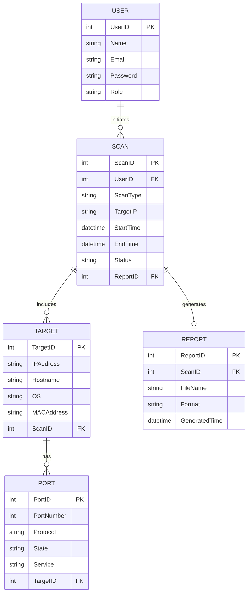

```mermaid
erDiagram
    USER {
        int UserID PK
        string Name
        string Email
        string Password
        string Role
    }
    SCAN {
        int ScanID PK
        int UserID FK
        string ScanType
        string TargetIP
        datetime StartTime
        datetime EndTime
        string Status
        int ReportID FK
    }
    TARGET {
        int TargetID PK
        string IPAddress
        string Hostname
        string OS
        string MACAddress
        int ScanID FK
    }
    PORT {
        int PortID PK
        int PortNumber
        string Protocol
        string State
        string Service
        int TargetID FK
    }
    REPORT {
        int ReportID PK
        int ScanID FK
        string FileName
        string Format
        datetime GeneratedTime
    }

    USER ||--o{ SCAN : initiates
    SCAN ||--o{ TARGET : includes
    TARGET ||--o{ PORT : has
    SCAN ||--o| REPORT : generates
```
