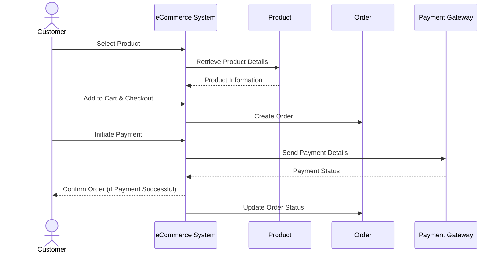

# Sequence Diagram: eCommerce System


```

# Legend:
- **Customer**: The user who is buying the product.
- **eCommerce System**: The platform where the transaction takes place.
- **Product**: Represents the details and information of a product.
- **Order**: A generated order upon checkout.
- **Payment Gateway**: Third-party service used to process payments.
```
